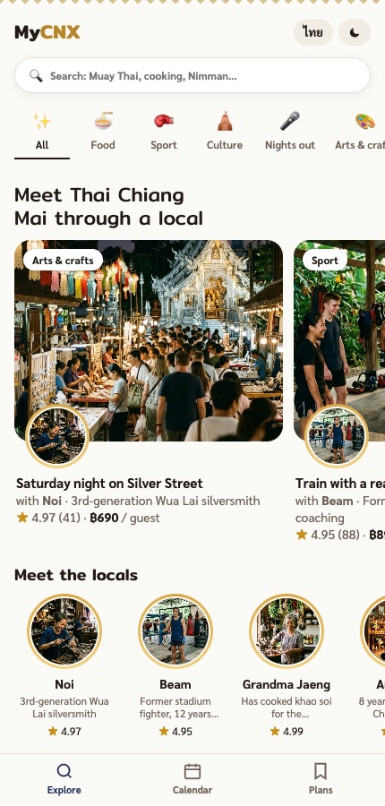
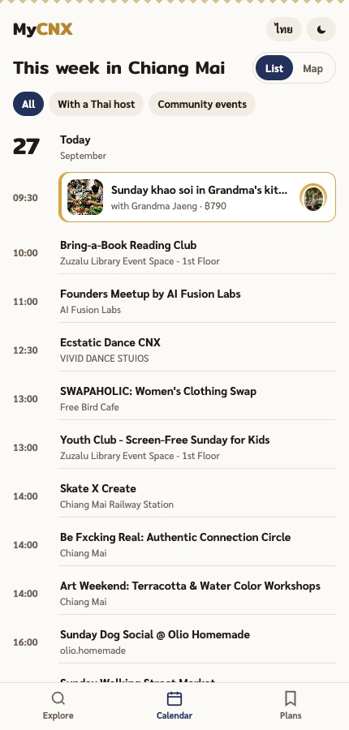
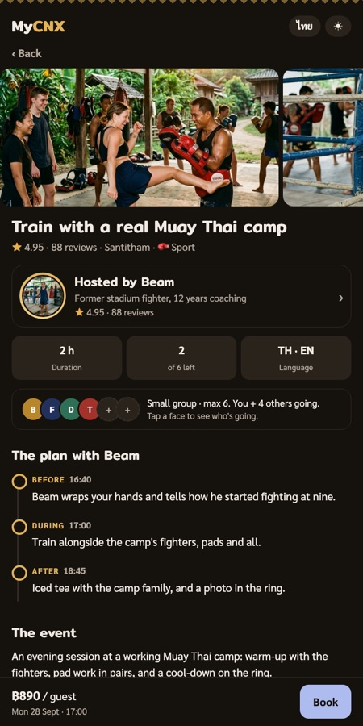
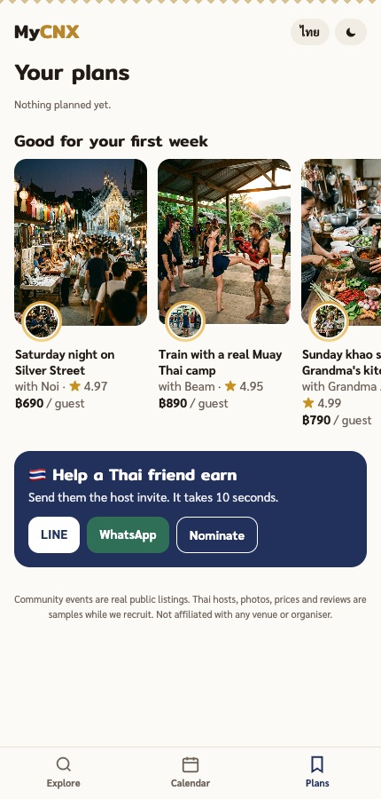
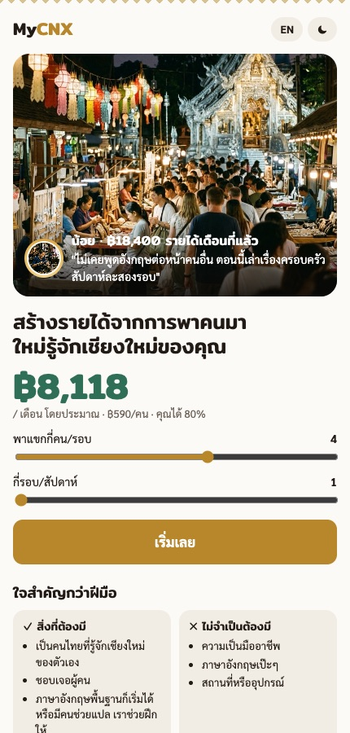

# MyCNX: meet Thai Chiang Mai through a local

Chiang Mai Hackathon, 26 September 2026, Mövenpick Hotel.
Team: Toby, Ryan, Slava, Jesse, Molly.

| Explore | Calendar | Experience | Plans | Host side (Thai) |
|---|---|---|---|---|
|  |  |  |  |  |

Newcomers who move to Chiang Mai for months often never get to know Thai people. The city's community calendar is full, but it's mostly where foreigners meet other foreigners, and tours sell sights, not people.

**MyCNX mixes small, paid experiences hosted only by Thai locals into a free calendar of real community events.** Muay Thai at a working camp, Sunday khao soi in a family kitchen, the Saturday silver street with a silversmith's daughter. Guests request a spot, vote for what they want next, and nominate Thai friends who'd be great hosts.

See [DECISIONS.md](DECISIONS.md) for the lean canvas and why each choice was made.

## What's in the prototype

Everything runs inside a phone frame. It's built for mobile first. Three tabs for newcomers, and a separate host side for Thai locals.

- **Explore:** people first. Experience cards lead with the host's face in a gold ring, then "Meet the locals", a short "This week" agenda, sample guest quotes, "Which Thai experience do you want?" and "Nominate a Thai local".
- **Calendar:** one schedule for the week. Thai-hosted sessions stand out in gold; the real community events sit between them. Filter by all, with a Thai host, or community events. Switch to the map to see where the hosted sessions are.
- **Plans:** your requests, votes and nominations, plus "Help a Thai friend earn" to send the host invite by LINE or WhatsApp. Empty, it suggests first-week experiences.
- **Experience page:** the host, the small group (max 6), a Before / During / After timeline, what to bring, good-to-know notes, a map, reviews on four dimensions, and "More with this host" and "You might also like".
- **Host profile:** why they host, their community, social links with follower counts, their experiences and reviews.
- **Request a spot:** pick a date and group size, leave a name and a LINE, WhatsApp or email contact. Nothing to pay until the host confirms; then the guest pays through MyCNX by PromptPay QR.
- **Host side (opens in Thai):** an earnings estimator, host stories, "It's the will, not the skill", guest-voted "Hosts wanted" ideas, and a 4-step application (including English level) followed by a call from the community manager. On a desktop, "View as: Newcomer / Thai host" above the phone switches sides.
- **Thai and English** throughout, plus light and dark modes.

## Where the data comes from

The event names, times and places come from a curated calendar of public Chiang Mai event listings (Meetup, Todo.Today, Sola, Playtomic, Facebook). `data/feed.json` is a snapshot of the events this demo uses. The descriptions are short summaries in our own words, and private individuals' names are removed. These are weekly events, so the page rolls each one forward week by week and always shows upcoming dates. When the page runs inside Claude, it reads the live calendar instead.

MyCNX is not affiliated with any venue, organiser or event shown.

**Sample content:**
- The hosts, their stories, earnings, follower counts, reviews, ratings, guests, chats and prices are all made up for the demo.
- All photos were generated with Google's Gemini image model (`gemini-3.1-flash-image`).
- No real person is shown as a host.

## Run it

It's a single static page with no build step. Serve the folder, because browsers block the event snapshot when the page is opened as a plain file:

```
python3 -m http.server 8000
```

Then open http://localhost:8000. It's designed for a phone-sized screen.

## How it was built

- **Built at the hackathon:** the product concept, this page (plain HTML, CSS and JavaScript, no framework), the host and experience content, the Thai and English copy, and the images. We built it with Claude as a Claude artifact.
- **Already existed:** the events pipeline that gathers and removes duplicates from Chiang Mai listings into one calendar. It isn't in this repo.
- **Fonts:** Mitr and Sarabun from Google Fonts, under the SIL Open Font License.
- **Sign-ups:** requests, votes, nominations and host applications go to a Google Sheet once `API` in `index.html` is set (see [backend/README.md](backend/README.md)). Until then the app is in demo mode and says so.
- **Event refresh:** the events pipeline (not in this repo) exports the next 8 days of the calendar, removes private names, rewrites descriptions and commits `data/feed.json`.

## Business model

Guests pay per person (about ฿490 to ฿990). The host keeps 80%. Groups are capped at 6, so introductions stay personal.

## License

MIT, see [LICENSE](../LICENSE).
