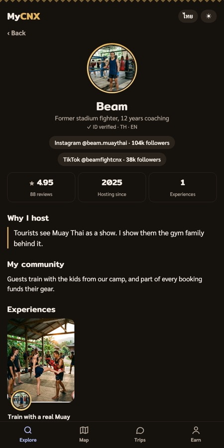
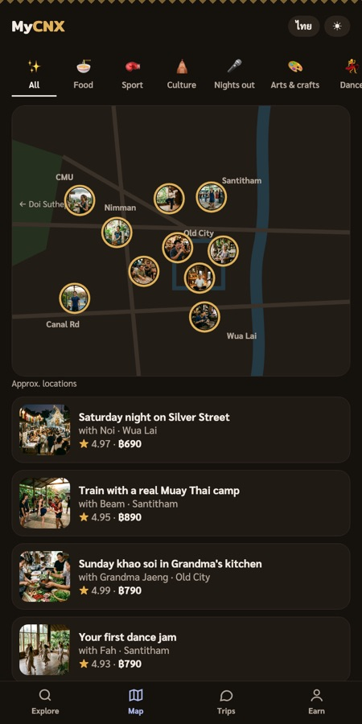

# MyCNX: go with a regular

Chiang Mai Hackathon, 26 September 2026, Mövenpick Hotel.
Team: Toby, Ryan, Slava, Jesse, Molly.

| Explore | Experience | Host profile | Map | Earn (Thai) |
|---|---|---|---|---|
|  |  |  |  |  |

Chiang Mai has something social on every night: run clubs, game nights, temple meditation, dance jams, padel, night markets. Newcomers rarely go, because walking into a room of strangers is hard. Airbnb Experiences only sells one-off tourist outings, where you meet other tourists and nobody stays in touch.

**MyCNX pairs you with a local host who is already a regular.** They meet you before the event, bring you in, introduce you to the people who matter, and add you to the group chat afterwards. The events are real and recurring. The host is what you book.

## What's in the prototype

Everything runs inside a phone frame. It's built for mobile first.

- **Explore:** a discovery page, not an endless feed. It has search, category filters, a Featured carousel, "This weekend", "Meet the locals" and a row per category. Every card leads with the host's face in a gold ring.
- **Experience page:**
  - The host.
  - A small-group line: max 6, and you can tap the faces of who's going.
  - A Before / During / After timeline of what the host adds.
  - The real event it's built on, what to bring, and good-to-know notes.
  - A map, and reviews with ratings on four dimensions.
  - "More with this host" and "You might also like", so the page never dead-ends.
- **Host profile:** why they host, their community, social links with follower counts, their experiences and reviews.
- **Booking:** pick a date and group size, then send a request. It opens a group chat with the host and the other guests (Trips tab).
- **Map:** host-photo pins with category filters.
- **Earn (for hosts, opens in Thai):**
  - An earnings estimator and host stories.
  - "It's the will, not the skill": what you need and what you don't.
  - "Hosts wanted" listings from guests and venues, or suggest your own idea.
  - A 4-step sign-up that goes live immediately, followed by a welcome call with the community manager.
- **Thai and English** throughout, plus light and dark modes.

## Where the data comes from

The event names, times and places come from a curated calendar of public Chiang Mai event listings (Meetup, Todo.Today, Sola, Playtomic, Facebook). `data/feed.json` is a snapshot of the events this demo uses. The descriptions are short summaries in our own words, and private individuals' names are removed. These are weekly events, so the page rolls each one forward week by week and always shows upcoming dates. When the page runs inside Claude, it reads the live calendar instead.

MyCNX is not affiliated with any venue, organiser or event shown.

**Sample content:**
- The hosts, their stories, earnings, follower counts, reviews, ratings, guests, chats and prices are all made up for the demo.
- All photos were generated with Google's Gemini image model (`gemini-3.1-flash-image`).
- No real person is shown as a host.

## Run it

It's a single static page with no build step. Serve the folder, because browsers block the event snapshot when the page is opened as a plain file:

```
python3 -m http.server 8000
```

Then open http://localhost:8000. It's designed for a phone-sized screen.

## How it was built

- **Built at the hackathon:** the product concept, this page (plain HTML, CSS and JavaScript, no framework), the host and experience content, the Thai and English copy, and the images. We built it with Claude as a Claude artifact.
- **Already existed:** the events pipeline that gathers and removes duplicates from Chiang Mai listings into one calendar. It isn't in this repo.
- **Fonts:** Mitr and Sarabun from Google Fonts, under the SIL Open Font License.
- **Bookings and host sign-ups:** saved only when the page runs inside Claude. When the page runs on its own, they are demo-only and nothing is sent.

## Business model

Guests pay per person (about ฿490 to ฿990). The host keeps 80%. Groups are capped at 6, so introductions stay personal.

## License

MIT, see [LICENSE](../LICENSE).
